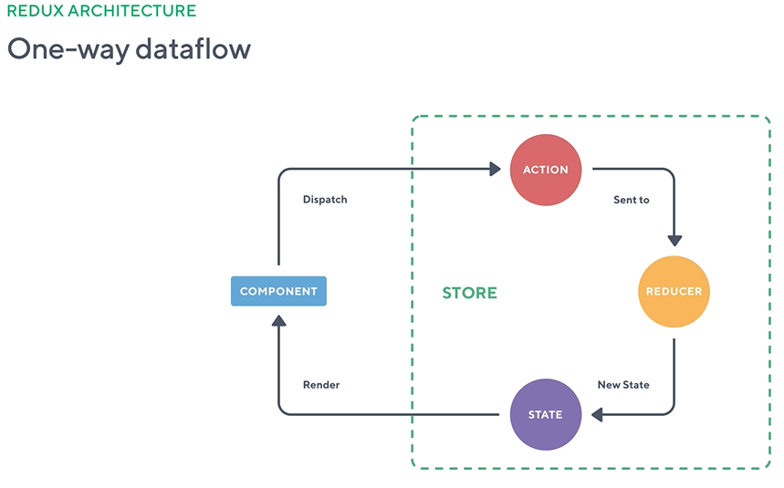

<!-- START doctoc generated TOC please keep comment here to allow auto update -->
<!-- DON'T EDIT THIS SECTION, INSTEAD RE-RUN doctoc TO UPDATE -->
**Table of Contents**  *generated with [DocToc](https://github.com/thlorenz/doctoc)*

- [Build a Store using Reactive Programming Style](#build-a-store-using-reactive-programming-style)
  - [Redux Architecture](#redux-architecture)
  - [Implement Redux Store](#implement-redux-store)

<!-- END doctoc generated TOC please keep comment here to allow auto update -->

## Build a Store using Reactive Programming Style

### Redux Architecture

 Why REACTIVE:

{

 - scale insanely, reduce latency

 - Reactive example : Microsoft EXCEL, everything in IT, nowdays is reactive interaction.

 - Programming in reactive + functional style.

 - functional = (functional composition + lazy evaluation);

 - lazy evaluation == efficiency (avoiding things that shouldn't be done in the first place)

 - do not expose your datatabase(never share databases!), instead export your data

}

 - reactive programming = dataflow computing:
 
  using REDUX == Single STATE TREE(a big Plain JavaScript Object) inside STORE - we use a REDUCER (Pure function) to update the STATE:

respond to action types, returning a new state.

Both in a) and b) rective styles we use immutable update patterns: 



we do not change the data stream from the input, but rather obtain a new data, and use it.

Use immutable data(by default objects, arrays are mutable and are passed by reference, but strings and numbers are immutable):

    - predictability

    - explicit state change

    - performance (change detection)

    - mutation tracking

    - undo state changes


    The STATE is a representation of the application wich resides in a centralized STORE. The STORE allows to:

    - monitor

    - read state values

    - monitor/observe changes to state


### Implement Redux Store

`npm install awesome-typescript-loader --save-dev`

 - The STORE contains the subscribers, manages reducers(observers) and state (observables):

 ```TypeScript
 export class Store {
  private subscribers: Function[];
  private reducers: { [key: string]: Function };
  private state: { [key: string]: any };

  constructor(reducers = {}, initialState = {}) {
    this.subscribers = [];
    this.reducers = reducers;
    this.state = this.reduce(initialState, {});
  }

  get value() {
    return this.state;
  }

  subscribe(fn) {
    this.subscribers = [...this.subscribers, fn];
    this.notify();
    return () => {
      this.subscribers = this.subscribers.filter(sub => sub !== fn);
    };
  }
  // propagate the action and notify each subscriber
  dispatch(action) {
    this.state = this.reduce(this.state, action);
    this.notify();
  }

  private notify() {
    this.subscribers.forEach(fn => fn(this.value));
  }

  private reduce(state, action) {
    const newState = {};
    for (const prop in this.reducers) {
      newState[prop] = this.reducers[prop](state[prop], action);
    }
    return newState;
  }
}
```
 - Reducers have an initialState, an action that has a type and a payload and are used to return the state after the reduce procedure:

 ```TypeScript
 export const initialState = {
  // ..
};

 export function reducer(
  state = initialState,
  action: { type: string; payload: any }
) {
  switch (action.type) {
    case actions.ADD_TODO: {
      const todo = action.payload;
      const data = [...state.data, todo];
      return {
        ...state,
        data,
      };
    }
    // ..
  }

  return state;
}
```

Actions have type for identification and payload to process:

```TypeScript
// action constants
export const ADD_TODO = '[Todo] Add Todo';
// ...

// action creators
export class AddTodo {
  readonly type = ADD_TODO;
  constructor(private payload: any) {}
}
// ...
```
 - in app.ts we dispatch actions:

```TypeScript

// reducers are the streams of data(observables) that come over time, after appling  some filters (reduce = a function that makes a switch = a filter to another stream of data = observable)
const reducers = {
  todos: store.reducer,
};

//we create a particular, centralized store for a particular stream of data 
const ToDOListStore = new store.Store(reducers);

//the store instance emits the new STATE TREE = current state of the app, after propagating the AddTodo action for the `todo` payload
ToDOListStore.dispatch(new store.AddTodo(todo));
// ..
```
